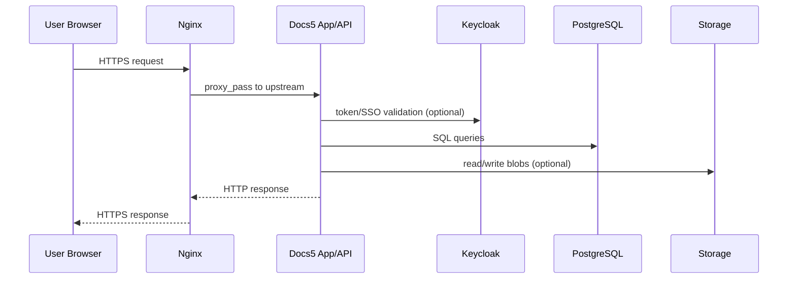

# Bölmə 1. Docs5 arxitekturasını başa düşmək

Bu bölmədə Docs5 ekosistemini “komponentlər + əlaqələr” kimi düşünməyi öyrənəcəyik. Məqsəd odur ki, problem gələndə “haradan başlayaq?” sualına sistematik cavab verə biləsiniz.

## 1.1 Docs5 ekosistemi nədir

Docs5 adətən bir neçə servis və asılılıqdan ibarət olur:

- istifadəçi interfeysi (web)
- API/back-end servis(lər)i
- verilənlər bazası (PostgreSQL)
- fayl saxlama (Storage)
- autentifikasiya/avtorizasiya (Keycloak)
- secret/konfiq idarəetməsi (Vault və ya vault.settings)
- reverse proxy (Nginx)
- əlavə util-lər (migration, preview generation və s.)

BA üçün əsas fikir: sistem “tək tətbiq” deyil. Bir yerdə problem görünəndə, səbəb başqa komponentdə ola bilər.

## 1.2 Əsas komponentlər

### Web

- User browser burada işləyir.
- Tipik problem simptomları: səhifə açılmır, 502/504, login loop, JS error.

### PostgreSQL

- Metadata, biznes obyektləri, sistem parametrləri, iş axınları və s. burada olur.
- Tipik simptomlar: səhifələr yavaş açılır, axtarış qırılır, “DB connection failed”, migrasiya problemləri.

### Storage

- Faylların binar hissəsi (blob data) saxlanır.
- Tipik simptomlar: fayl upload/download işləmir, preview açılmır, “file not found”, “access denied”.

### Keycloak

- SSO/login, token, realm/client konfiqurasiyası.
- Tipik simptomlar: login alınmır, token invalid, redirect səhv, “unauthorized”.

### Vault (və ya `vault.settings.json`)

- Secret-lar: connection string, password, API key və s.
- Tipik simptomlar: servis start olmur (config çatmır), auth/DB bağlantısı qırılır.

> Qeyd: Bu repo-da util-lərin `appsettings.json` faylları çox vaxt yalnız `"PrependConfigFiles": ["vault.settings.json"]` kimi sadə olur. Bu o deməkdir ki, real connection string və secret-lar ayrıca `vault.settings.json` içində saxlanılır və konteynerə mount edilir.

### Nginx

- Reverse proxy: domain-ləri servis(lər)-ə yönləndirir.
- Tipik simptomlar: 502 Bad Gateway, 404/403, TLS certificate error.

### Əlavə servislər (util-lər)

Docs5 əməliyyatlarında tez-tez “utility” konteynerləri işlədilir:

- DB migration
- schema/table/column renaming
- preview generation
- storage migration

Bu repodakı `Sources/utils/*/docker-compose.yml` fayllarında bu pattern görünür: bir “dotnet util” image-i işə düşür, öz DLL-ni və `appsettings.json`-u mount edir.

Misal pattern (sadələşdirilmiş):

```yaml
version: "3.3"
services:
  wssutil:
    image: images.wss-consulting.ru/dot/docs/prod:latest
    restart: "no"
    volumes:
      - "/etc/ssl/certs:/etc/ssl/certs:ro"
      - "./appsettings.json:/app/appsettings.json:ro"
      - "../../vault.settings.json:/app/vault.settings.json:ro"
      - "./Some.Util.dll:/app/util.dll:ro"
      - "./Some.Util.runtimeconfig.json:/app/util.runtimeconfig.json:ro"
      - "./Some.Util.deps.json:/app/util.deps.json"
    entrypoint: ["dotnet", "util.dll"]
```

BA üçün nəticə: belə util-lər adətən “bir dəfə işləyib çıxır” (restart: no), logları oxunur, nəticəyə görə növbəti addım seçilir.

## 1.3 Sorğunun sistem daxilində hərəkəti

İstifadəçi browser-də `https://docs.example.az` açır:

1. DNS domeni server IP-sinə yönləndirir
2. Nginx 443 portunda sorğunu qəbul edir
3. Nginx upstream kimi web/app servisinə yönləndirir
4. App servisi ehtiyac olduqda:
   - PostgreSQL-ə query atır
   - Storage-dan fayl oxuyur
   - Keycloak-dan token yoxlayır
5. Cavab Nginx → browser geri qayıdır

Mermaid sxem (sadə):



## 1.4 Hansı problem hansı komponentdə axtarılmalıdır

Triage üçün “simptom → ehtimal olunan komponent” xəritəsi:

- **502 Bad Gateway** → Əgər Docs loglarda error vermirsə deməli Nginx upstream-ə çıxa bilmir (app down, port dəyişib, network problem)
- **Login alınmır** → Keycloak (realm/client), Nginx redirect, time drift
- **Fayl preview açılmır** → Storage, preview generation util, app config
- **DB connection error** → PostgreSQL servis, credential/secret, network, pg_hba
- **Yavaşlıq** → DB performans, disk doluluğu, CPU/RAM, network

Prinsip: Ən əvvəl “aşağı qat” yoxlanır:

- servis ayaqdadır?
- port açıqdır?
- logda konkret error var?

## 1.5 Domen, port, konteyner və servis əlaqəsi

Ümumi model:

- Domain (məs: `docs.company.az`) → Nginx (80/443)
- Nginx `server_name` ilə uyğun bloku seçir
- `proxy_pass` ilə daxildəki upstream-ə yönləndirir:
  - ya host port (məs: `127.0.0.1:5000`)
  - ya docker network servis adı (məs: `http://docs-app:5000`)

BA üçün kritik suallar:

- İstifadəçi hansı domain-ə girir?
- Həmin domain Nginx-də hara proxy olunur?
- Proxy olunan servis/container işləyirmi?

## 1.6 Test və production yerləşdirmə modelləri

Docs5 yerləşdirməsi müxtəlif ola bilər:

- **Single host + Docker Compose**: ən tipik; Nginx + app + db + keycloak + storage eyni hostda.
- **Separated DB**: PostgreSQL ayrıca serverdə; app-lar docker hostda.
- **Kubernetes**: bəzi təşkilatlarda.

BA üçün fərq nədir?

- “Harada axtarım?” sualının cavabı dəyişir.
- Portlar, network segmentlər, firewall qaydaları daha kritik olur.

---

Növbəti bölmədə Linux əsasları: fayl sistemi, permission, sudo, paket menecerləri və ən vacib gündəlik komandalar.
